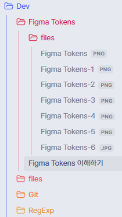

# 적용 방법

npm run build 를 하면 나오는 main.js 과 manifest.json를 기존 폴더 auto-note-mover에 덮어쓴다

## 추가 된 기능

지정한 태그의 하위 폴더에 있을 경우 이동 제외

## 설명

기존 동작은 Dev/Figma Tokens/Figma Tokens 이해하기.md 가 Dev/Figma Tokens.md 로 이동해야한다 

위 상황에서 auto-note-mover 작동할 때  
이동해야할 파일이 이미 하위 폴더에 존재하면

  
가 나오면서 이동하지 않도록 수정함
